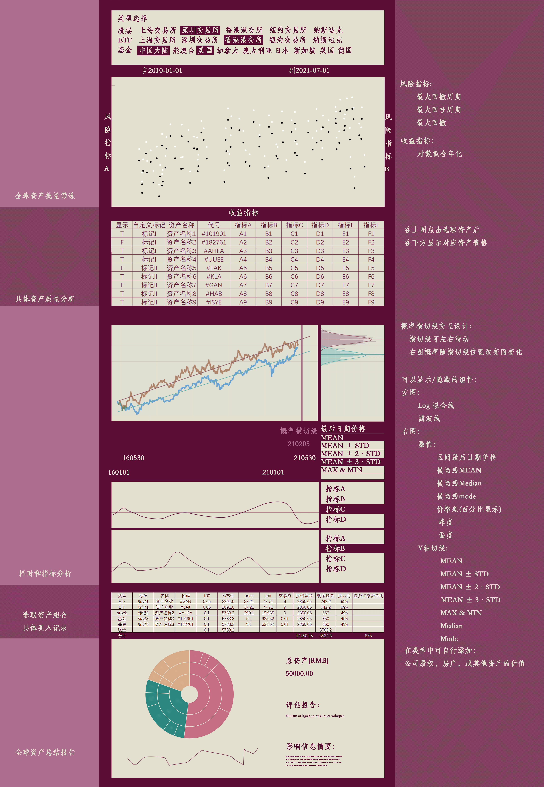

# GlobalAsset

# 设计


# 文档
- sp > 真实样本数据，以供前段可视化测试
  - info > 存放资产的名称，类型等信息
  - raw > 具体的序列文件，包括日期，价格等
  - valid.csv > raw文件夹中的资产始末信息
  - T210331.csv > 提取出来的指标文件
 - src > 用来存放python 源码
   - app.py > 在里面写用flask写后端
   - [ ] select.py > 在里面合并抓取资产并返回json文件，共app.py 使用
       ```
       def select(tp2ex, showkey):
         tp2ex : dict: {资产类型: list of 交易所代码}
         showKey: list: [需要展示的key] 
         return: dcit {资产代码：[showKey中的key，在表格中对应的value]}
         使用pandas实现
         步骤：
           1. info_df = merge info文件夹的内容
           2. dt_df = join valid.csv,T210331.csv 
           3. 用pandas，条件筛选
           4. 格式转换成字典，输出
       ```    
 
 # 代码规范：
 1. 所有.py 文件 indent 默认 2 个 space
